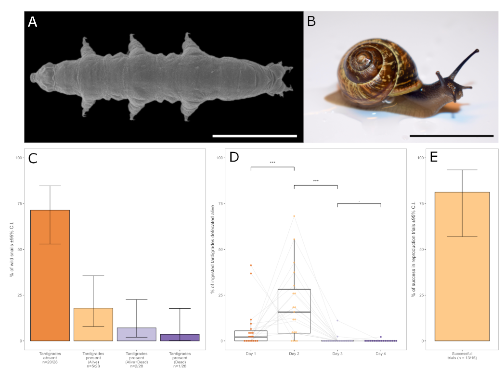

# Tardigrades in Snail Feces Project Data analysis and Plotting
    
Data, Data Analysis and Plotting associated with the manuscript "A lift in snail’s gut provides an efficient colonization route for tardigrades"
by Vuori T., Calhim S., and Vecchi M.

* This repository contains:
    + **survival.txt**: The raw data from the laboratory feeding experiment
    + **script.R**: R script to analyze the data and crete the plots presented in the paper
    + **README.md**:  This README file
    + **Figure-png**: The source file for the figure showed in the README file
